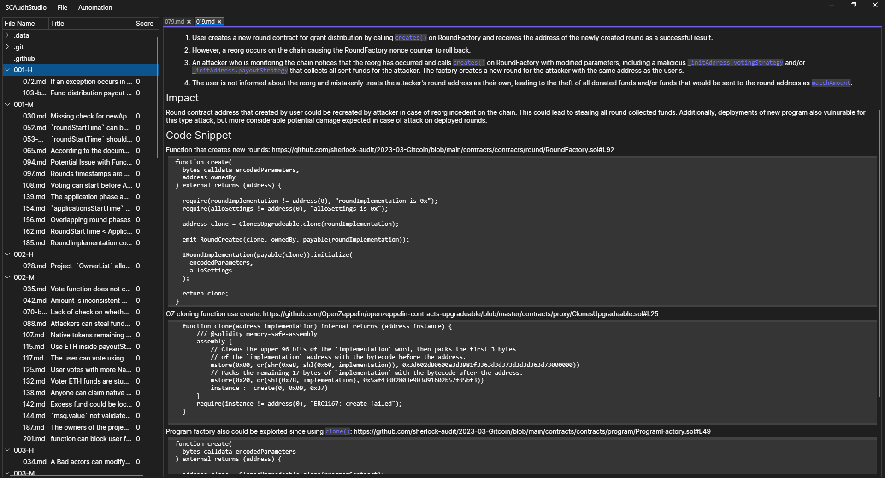
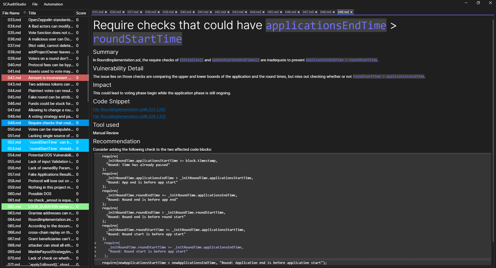

# SCAuditStudio

## Getting Started
Download the "build.zip" file, unpack and run the .exe. You can also fork this repo and build it in Visual Studio 2022.
Start judging by create a local directory using the sherlock judging repository.
1. Start the SCAS app.
2. Select "Judge Contest" or "Audit Project" 
3. Open your project
4. When read click save project, and push your changes
## Known Issues!!!
- add hotkeys  
- allow name change for folder  
- tree view show folder and files right  
- (md reader bugs)  
- color highlights not saved on close  
- settings menu  
- close tabs when open new project  
## Overview
SC Audit Studio, also known as the Smart Contract Audit Studio, is a powerful tool that serves as an all-in-one Integrated Development Environment for smart contract auditing. Its primary function is to help users analyze and identify vulnerabilities in the code or design of defi or WEB3 applications.

The process of smart contract auditing typically involves two phases:  
the research phase, where issues are identified, and the judging phase, where these issues are categorized. Although there are several companies and hundreds of independent security researchers that provide this valuable service, the most prominent platforms in this field are Sherlock.xyz, Code 4erna, and Immunefi.

The importance of smart contract auditing cannot be overstated in the realm of Web3 social.  
Every project that involves smart contracts must undergo a thorough auditing process to ensure its integrity and security.
## Roadmap
SCAuditStudio V2.0 (automate Sherlock judging)
UI/UX
- add basic UI [done]

Functionality to judge contests:
- file transfer [done]
- issue creation/editing [done]
- file highlight and mark [done]
- score calculation [WIP]
- auto invalidate issues [WIP]
- static sort issues [WIP]
- allow user to add own scripts and addones [nice to have]

SCAuditStudio V3.0 (Better Auditing)
UI/UX
- add basic UI 

Important features for IDE:
- visualize solidity code and relation between functions
- highlight and bookmark features
- mark acsess rights on functions (highlight external and state changing functions)
- highlight code changes since last audit
- auto slither
- ...
The current goal is to complete the V2.0 and update the future scope accordingly. 
## Documentation
Look inside ./Documentation 
## Supporter
You can donate to this address on:  
ETH: 0xB7588A8f964Ff6E76fC392567CcbCCe85700e990  
BTC: 37rJNAo9SRtCdqyhdaKqZLxF2qjzwJe2BL  
XMR: 46RiGk2SB5pez34EDEqQ993byRfqCS5pbXLxSaazSrG3YfLAmtHcsct9mJe9MwoWit75qbvT8xVNB5qYLrm7mNqTM5NPbb2  

or create a github PR
