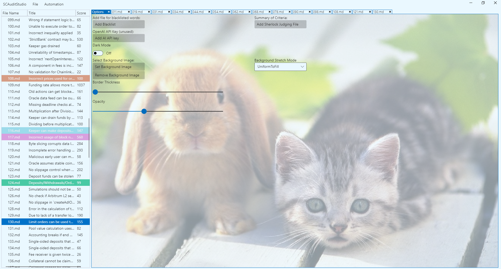

# SCAuditStudio - Judge Sherlock Contest Faster

## Getting Started
1. Download the latest windows or linux release depending on your system 
2. Start the SCAS app.
3. Select "Judge Contest" or "Audit Project"
4. Open your project
5. When ready, push your changes over github  
  
Watch this youtube video for more info: [How to use SCAuditStudio](https://www.youtube.com/watch?v=MoD9sPa7P9o)  

## Important Links  
[Twitter](https://twitter.com/SCAuditStudio)  
[Youtube](https://www.youtube.com/@SmartContractAuditStudio)  
[Website](http://scauditstudio.de/)

## Overview
SC Audit Studio, also known as the Smart Contract Audit Studio, is a powerful tool that serves as an all-in-one Integrated Development Environment for smart contract auditing. Its primary function is to help users analyze and identify vulnerabilities in the code or design of defi or WEB3 applications.

The process of smart contract auditing typically involves two phases:  
the research phase, where issues are identified, and the judging phase, where these issues are categorized. Although there are several companies and hundreds of independent security researchers that provide this valuable service, the most prominent platforms in this field are Sherlock.xyz, Code 4erna, and Immunefi.

The importance of smart contract auditing cannot be overstated.  
Every project that involves smart contracts must undergo a thorough auditing process to ensure its integrity and security.  
  

With our powerful background changing feature, you can effortlessly personalize your desktop by selecting any picture as your backdrop.  
Say goodbye to monotony and hello to a world of visual delight. Not only that, but our application also offers the flexibility of light and dark themes, ensuring optimal viewing comfort in any lighting condition.  
Take control of your desktop experience and embrace a new level of personalization with our feature-rich application.   

## Issues
please open issues if you notice anything

## Documentation
Look inside ./Documentation 

## Supporter
or create a github PR
